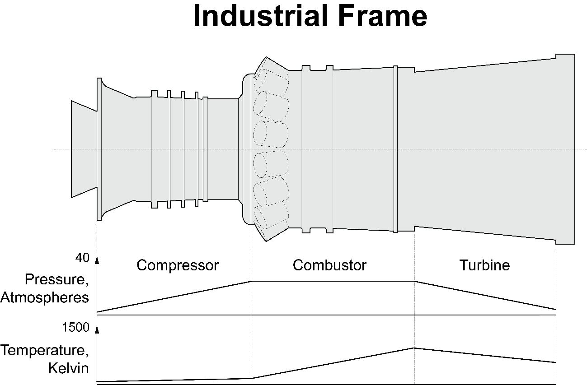
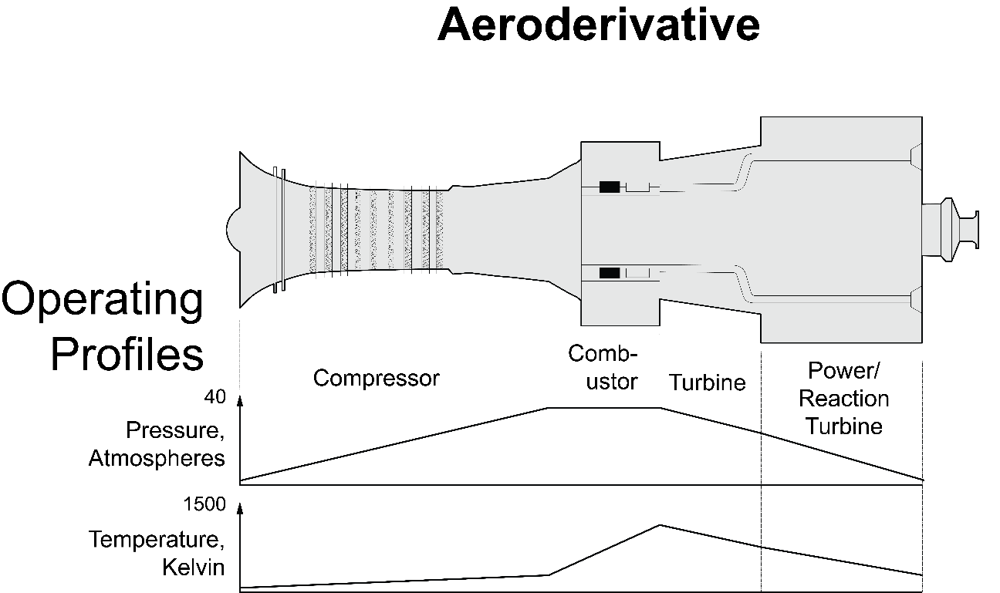
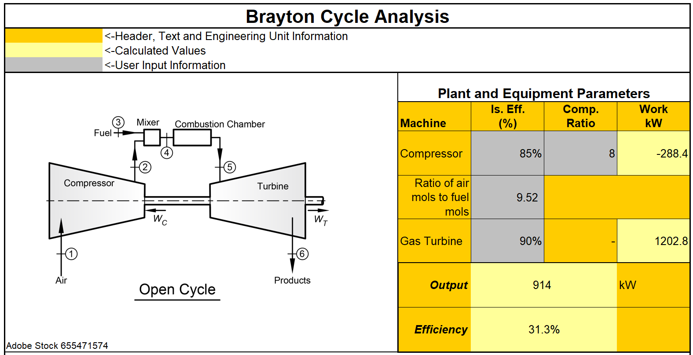
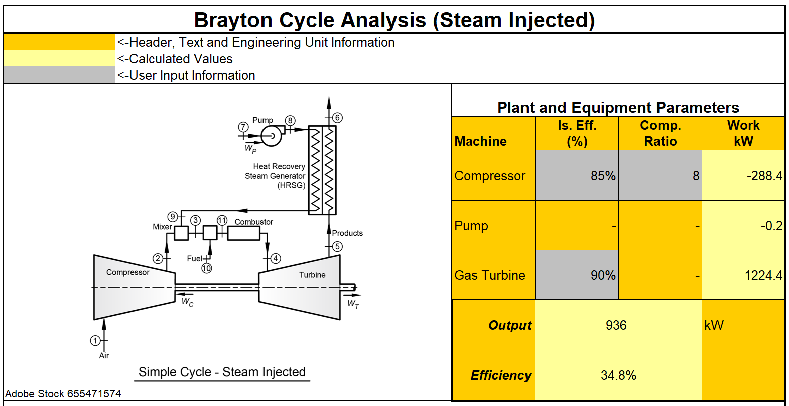

# State-Variable Analytics

This GitHub repository stores the source code for state variable analytics. C++ dynamic link libraries (DLLs) implement the analytics. In addition, the repository includes a Visual Basic for Applications (VBA) interface in Microsoft® Excel® for Microsoft 64-bit spreadsheets. The state variable analytics provide thermodynamic data for performance and chemical process calculations. The engine state variables include pressure, temperature, entropy, and enthalpy.

The code provides the state variable properties and analytics via an equation of state based on the Benedict–Webb–Rubin-Starling (BWRS) model.

In addition, the repository provides a library for calculating reciprocating machinery kinematics. Combining the state-variable analytics with the machine kinematic properties enables full simulation of reciprocating compressors. The combination also allows diagnostics by plotting measured pressures and temperatures against those predicted by the state-variable analytics.

The companion website (<https://robotsquirrelproductions.com/software-tools/>) hosts Excel example files for download. The files are being upgraded from 32-bit to 64-bit libraries, so testing and implementation have not been completed; however, they show how these libraries can be used in Excel.

The sections below provide descriptions of the libraries and provide examples of how the libraries can be used.

# GasAnalysis

This library has the code that solves the BWRS equation of state. The code operates in saturated vapor, saturated liquid, and vapor regions. It does produce results in the liquid region but with low accuracies.

With these functions, the vapor dome can be plotted against the measured reciprocating compressor pressures and temperatures. For example, the figure below shows the pressure-enthalpy vapor dome as a black line. The red lines show the measured compression process for three stages. This process falls on the vapor side of the dome, so this component should not condense as it passes through the intercoolers.

The GasAnalysis library can be combined with the MechAnalysis kinematic functions to plot isentropic (adiabatic) pressure against the indicated press for reciprocating compressors. The figure below shows an example of this.

# Gas Turbines (Brayton Cycle)

The equation of states in the GasAnalysis library can be used to solve gas turbine performance cycles. Figure 1 and Figure 2 show gas turbine outlines and operating pressure and temperature profiles.

Figure 1 – Outline of industrial frame gas turbine with operating pressure and temperature profiles (Adobe Stock File No. 667727151).

Figure 2 – Outline of industrial frame gas turbine with operating pressure and temperature profiles (Adobe Stock File No. 667727151).

## Brayton Cycle – Open

The install package (available from the companion website [Software Tools](https://robotsquirrelproductions.com/software-tools/#st_performancetools) page) with example calculations includes an open cycle [Brayton cycle analysis](https://1drv.ms/x/s!AsL0xhQs8znHmdRd6LrHnKdKYU182w?e=C8DHn5) (“BraytonCycle_Open_SI.xlsm”). The worksheet uses an adiabatic flame assumption to calculate combustion products. The code does not account for disassociation, so the results will not be absolutely accurate, compared to commercial code; however, the model accurately describes the changes in efficiency and power as inputs such as stoichiometric ratio, compression ratio, and efficiencies change.

Figure 3 – Screenshot from the open Brayton cycle analysis Excel® worksheet.

## Brayton Cycle – Steam Injected

The [OneDrive folder](https://1drv.ms/f/s!AsL0xhQs8znHmc5oV3nhe9GpZ4TSPQ?e=ryRQkD) also includes an [open Brayton cycle worksheet with steam injection](https://1drv.ms/x/s!AsL0xhQs8znHmdEC-vroM4Ft3kmuJQ?e=lzPXYa) (BraytonCycle_SteamInjected_SI.xlsm). In this configuration water passes through the exhaust gas to recover heat. After heating in the exhaust gases, the water mixes with air and passes through the gas turbine.

Figure 4 – Screenshot from the steam-injected open Brayton cycle analysis Excel® worksheet.
