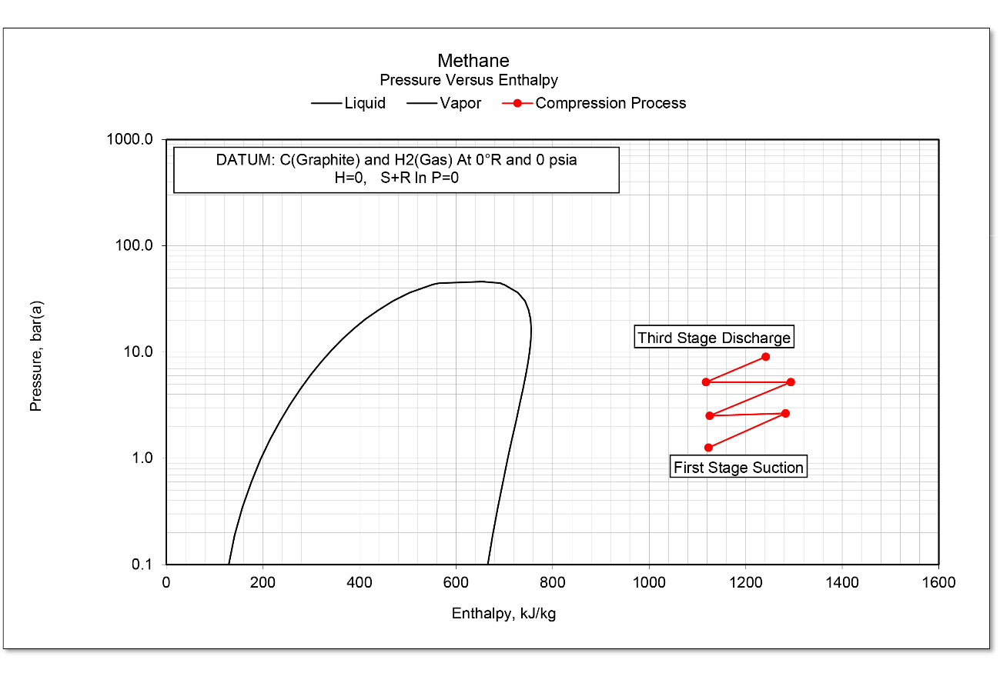
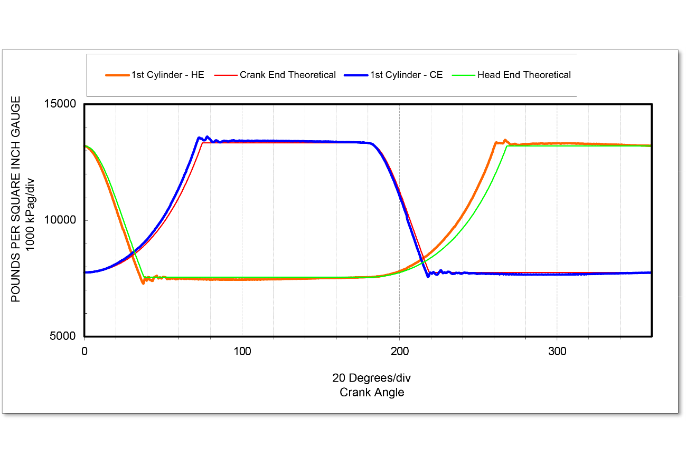

# State-Variable Analytics

This repository stores source code for state variable analytics through C++ dynamic link libraries (DLLs) and Visual Basic for Applications (VBA), in Microsoft® Excel® for Microsoft 64-bit spreadsheets. The state variable properties can be used in thermodynamic calculations and analytics. The engine state variables include pressure, temperature, entropy, and enthalpy.

The code provides the state variable properties and analytics via an equation of state based on the Benedict–Webb–Rubin-Starling (BWRS) model.

In addition, the repository provides a library for calculation reciprocating machinery kinematics. Combining the state-variable analytics with the machine properties enables full simulation of reciprocating compressors across various hydrocarbon gas mixtures in Excel. The combination also enables diagnostics by allowing measured pressures and temperatures to be plotted against those predicted by the state-variable analytics.

Excel example files can be downloaded from this [OneDrive folder.](https://1drv.ms/f/s!AsL0xhQs8znHmc5oV3nhe9GpZ4TSPQ?e=bpPeLo) The files are being upgraded from 32-bit to 64-bit libraries, so they should not be viewed as tested or completed implementations; however, they show how these libraries can be used in Excel.

The sections below provide descriptions of the libraries.

# GasAnalysis

This library has the code that solves the BWRS equation of state. The code operates in saturated vapor, saturated liquid, and vapor regions. It does produce results in the liquid region but with low accuracies.

With these functions, the vapor dome can be plotted against the measured reciprocating compressor pressures and temperatures. For example, the figure below shows the pressure-enthalpy vapor dome as a black line. The red lines show the measured compression process for three stages. This process falls on the vapor side of the dome, so this component should not condense as it passes through the intercoolers.

The GasAnalysis library can be combined with the MechAnalysis kinematic functions to plot isentropic (adiabatic) pressure against the indicated press for reciprocating compressors. The figure below shows an example of this.

